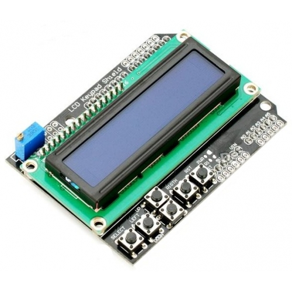

# LCDKeypad Arduino library

This library allows you to control display, read button state and toggle backlight of LCDKeypad shield. 

LCDKeypad shield is quite common and popular. It includes 16x2 HD44780 compatible LCD and 5 push buttons. Pins 4, 5, 6, 7, 8, 9 are used to interface with the LCD. Backlight on/off function is controlled via pin 10. Analog pin 0 is used to read the buttons.




## Install

* Download [latest release zip file](https://github.com/dzindra/LCDKeypad/releases/latest)
* In Arduino IDE, use _Sketch -> Import Library -> Add Library_ command
* Select the downloaded zip file

## Usage

Include library in sketch and declare lcdKeypad variable:

```c
#include <LiquidCrystal.h>
#include <LCDKeypad.h>

LCDKeypad lcdKeypad;
```

You can optionaly specify button analog pin (default A0) and backlight pin (default 10). Lcd pins are 8, 9, 4, 5, 6, 7. All the defaults pins can be changed by editing appropriate defines. You can also change button analog level values if default ones do not match your board.

## Functions

LCDKeypad extends LiquidCrystal class so you can use all the functions from LiquidCrystal and following new ones:

#### lcdKeypad.noBacklight()

Turn backlight off.

#### lcdKeypad.backlight()

Turn backlight on.

#### lcdKeypad.button()

Read the buttons. This function does not filter or debounce the buttons.

#### lcdKeypad.buttonBlocking(block_delay,repeat_delay)

Read filtered button states. After detecting button press for the first time and returning appropriate code this function returns `KEYPAD_BLOCKED` until `block_delay` milliseconds has passed. If the button is held after this time its code is returned once and then function returns `KEYPAD_BLOCKED` again for `repeat_delay` milliseconds. Great for use in menus or similar situations where you need only one button press code.

## License

&copy; 2014 Jindřich Doležy.

Based on the code by fj604 from http://forum.arduino.cc/index.php?topic=38061.0

[Licensed under the Apache License, Version 2.0](http://www.apache.org/licenses/LICENSE-2.0)